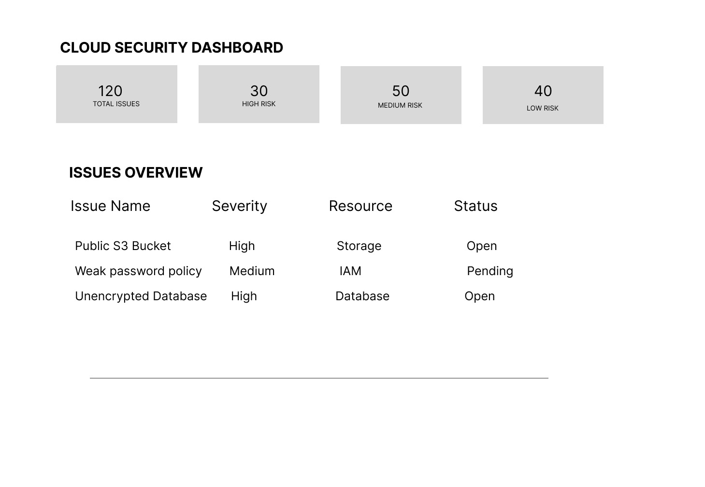
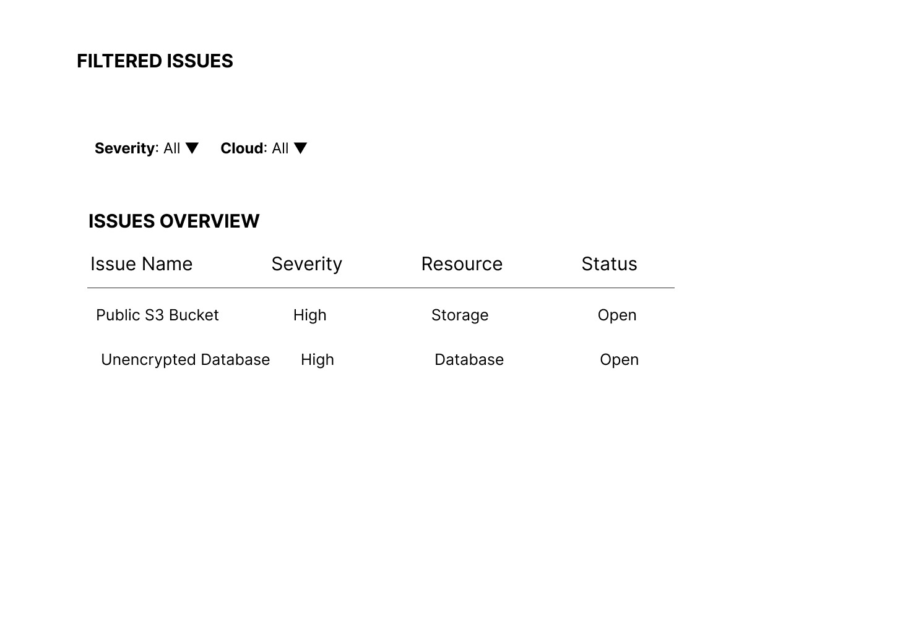
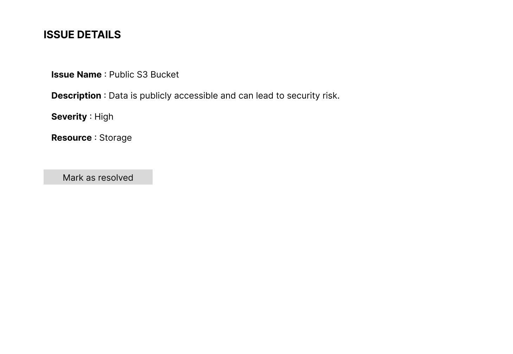

# Cloud-Posture-Dashboard--Assignment
## Problem Statement
Organizations using multiple cloud platforms face difficulty in identifying and managing security misconfigurations across accounts.

## Solution
Designed a Cloud Security Dashboard that provides a centralized view of issues, allows filtering, and helps users take action.

## Screens

### 1. Dashboard View

### 2. Filtered Issues View

### 3. Issue Details View

## Tools Used
- Figma (UI Design)

## Figma Link
https://www.figma.com/design/S3CJrAYwW9YlDLdoo80sDo/Archana-Cloud-Posture-Dashbard-Assignment?node-id=0-1&p=f&m=draw
